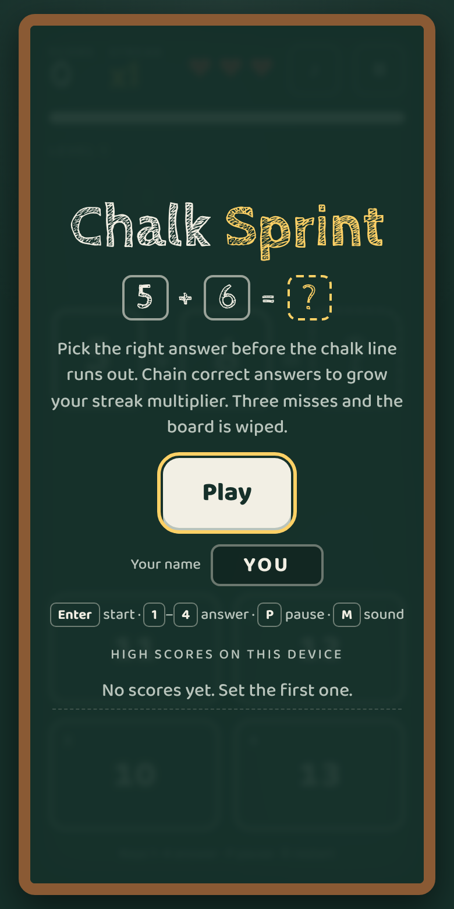
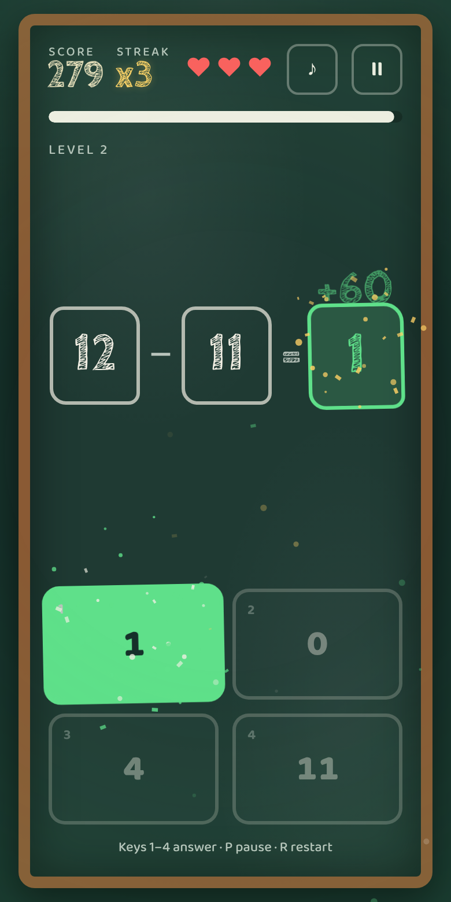
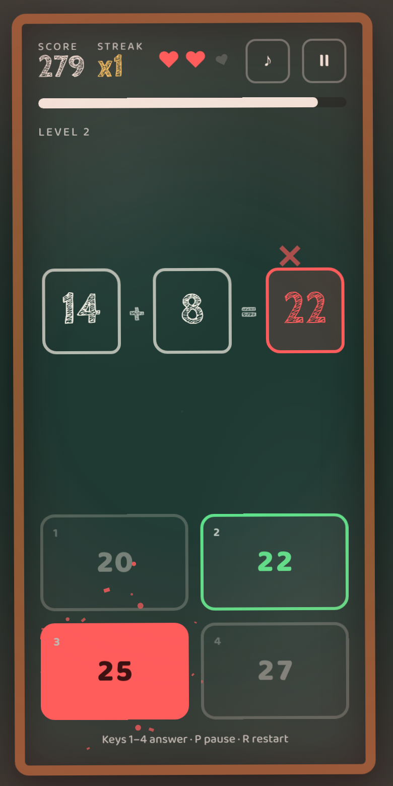
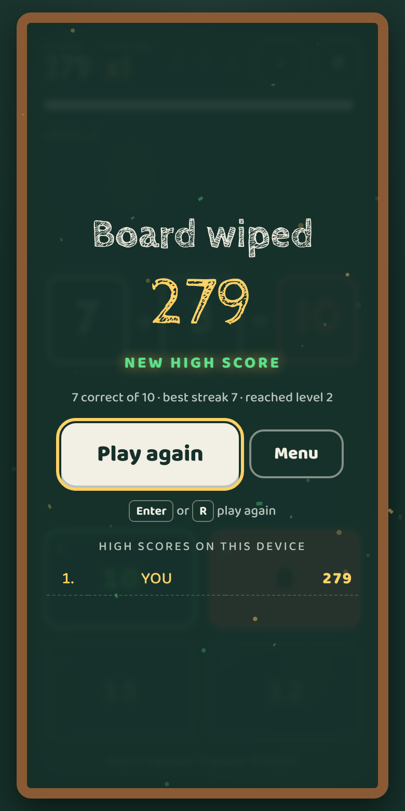

# Chalk Sprint

**A fast, juicy mental-math game on a chalkboard.** Each round shows three blocks, like `5 + 6 = ?`. Pick the right answer from four choices before the chalk line runs out.

▶️ **Play it:** https://pratyush100.github.io/ChalkSprintGame/

<p align="center">
  
  
  
  
</p>

## How to play

| Action | Keyboard | Touch / mouse |
| --- | --- | --- |
| Answer | `1` `2` `3` `4` | Tap an answer |
| Start / play again | `Enter` | Play button |
| Pause / resume | `P` or `Esc` | Pause button |
| Restart instantly | `R` | Restart button |
| Sound on / off | `M` | ♪ button |

- **Green** means correct: the block fills in and chalk dust bursts from your answer.
- **Red** means wrong: the board shakes and the correct answer lights up.
- **Faster answers score more.** Every 3 correct in a row raises your streak multiplier, up to **x5**.
- **Three misses** (wrong answers or running out of time) wipe the board.
- Every 5 correct answers you level up: bigger numbers, then subtraction, multiplication and division. Later levels hide the first or second number instead of the answer.
- The top 10 scores are saved in your browser.

## Features

- Instant start: you're answering your first question within a couple of seconds.
- Juicy feedback: screen shake, particle bursts, pop animations, floating score text, synthesized sound effects and phone vibration.
- Start, pause and game-over screens, with an auto-pause when you switch tabs.
- Smooth 60fps: one `requestAnimationFrame` loop, GPU-friendly transforms and a single pooled particle canvas.
- Works offline and installs to your home screen as a Progressive Web App.
- Respects *reduced motion* settings.
- No frameworks, no build step and no tracking. It's one HTML file plus a manifest and service worker.

## Run it locally

```bash
git clone https://github.com/pratyush100/ChalkSprintGame.git
cd ChalkSprintGame
python3 -m http.server 8000   # then open http://localhost:8000
```

Opening `index.html` directly also works, but offline mode needs a server.

## Publish it

- **Web:** turn on GitHub Pages (Settings → Pages → Deploy from branch → `main` / root).
- **Google Play:** paste the GitHub Pages URL into [PWABuilder](https://www.pwabuilder.com), download the Android package and upload it in the Play Console.
- **App Store:** wrap the folder with [Capacitor](https://capacitorjs.com) and build it in Xcode.

---

## Built with AI

This whole game was made by talking to an AI coding agent ([Claude](https://claude.ai)), starting from one paragraph:

> *Build a polished, playable browser game: Math game with 3 blocks eg: 5+6 = ___ give the user 4 options to choose from and give red or green result if the answer is correct. Make the core loop fun within the first ten seconds, with tight controls for both keyboard and touch, and juicy feedback — screen shake, particle effects, and satisfying animations. Include a start screen, a score system, pause and game-over states with instant restart, and a local high-score table…*

From that prompt, the AI:

1. **Designed the game.** It picked the chalkboard theme, fonts and colors, the difficulty curve, and the scoring rules (speed bonus plus streak multiplier).
2. **Wrote all the code.** That covers the HTML, CSS and JavaScript for game states, question generation with believable wrong answers, the particle system, Web Audio sound effects and the high-score table.
3. **Played its own game.** It drove the game in a headless browser, solving equations and making mistakes on purpose. That's how it caught and fixed a bug where screens overlapped. The screenshots above came from those test runs.
4. **Packaged it for release.** It drew the app icons in code, added the manifest and offline service worker, and checked that the game still runs with the internet off.
5. **Shipped it.** It committed the game to this repository and explained how to publish it on the web, Google Play and the App Store.

### How AI is changing game development

- **Prototype in minutes.** Describe a game idea in plain language and get something playable to judge right away. You can try ten ideas in the time one used to take.
- **One person, whole team.** AI can handle code, UI, sound design (synthesized here), icons and store copy, so solo makers can ship finished-feeling games.
- **Automated playtesting.** AI agents can play builds, hunt for bugs, take screenshots and check edge cases on every change.
- **Content and balance.** AI can generate levels, puzzles and questions, and tune difficulty curves so players stay challenged without getting frustrated.
- **Porting and publishing.** The same game can be turned into a web app, an Android app or an iOS app, with the setup steps explained along the way.

**What still needs a human:** deciding what's *fun*, playtesting with real players, owning the creative direction, and reviewing what the AI produces. AI is a fast, tireless collaborator, and the best results still come from a person with taste steering it.

---

Made by [@pratyush100](https://github.com/pratyush100) with Claude.
